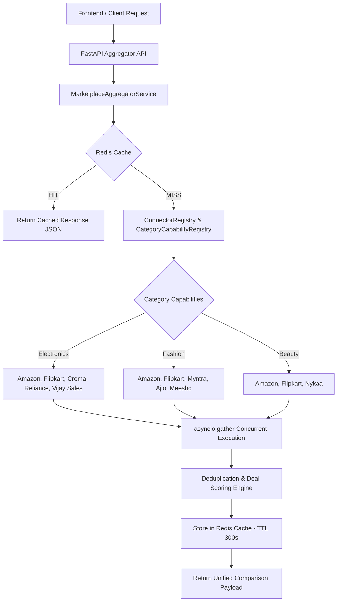
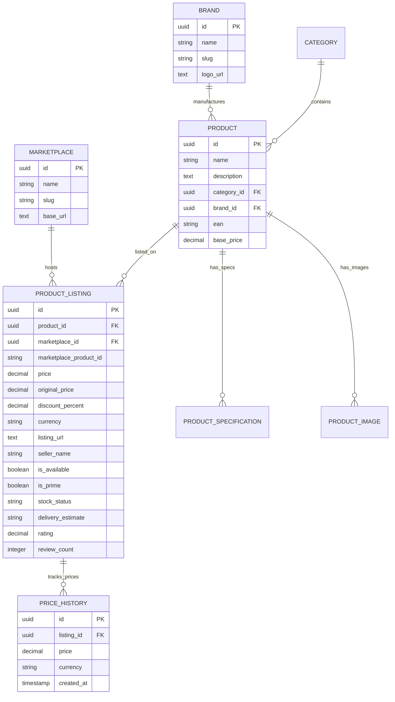

<div align="center">
  
  <br /><br />
  
  <a href="#">
    
  </a>
  <a href="#">
    
  </a>
  <a href="#">
    
  </a>
  <a href="#">
    
  </a>
  <a href="#">
    
  </a>
  <a href="#">
    
  </a>
  <br /><br />
  
  <h1>COMPAREX</h1>
  <p><strong>AI Shopping Intelligence Platform</strong></p>
  <p>Compare products across 10+ marketplaces with real-time prices, personalized recommendations, and instant deal alerts.</p>
</div>

---

## 🚀 Overview

COMPAREX is a production-quality AI Shopping Intelligence Platform that aggregates product pricing from multiple marketplaces, applies AI-driven analysis, and delivers personalized shopping insights.

- **Phase 1**: Project foundation (Frontend shell, FastAPI backend, Docker, GitHub Actions).
- **Phase 2**: Core authentication, JWT state management, Remember Me, protected routes, interactive dashboard widgets, product catalog & price comparison matrix.
- **Phase 3**: Marketplace Intelligence Core — complete normalized domain models (`Product`, `Marketplace`, `ProductListing`, `PriceHistory`, `Category`, `Brand`, `ProductSpecification`, `ProductImage`), Marketplace Abstraction Layer & `MarketplaceFactory`, Comparison Engine, non-AI Product Matching Engine, dedicated Compare UI (`/compare/[id]`), and 100% clean CI linters.
- **Phase 4**: Production-Ready Marketplace Connector Framework — `ConnectorRegistry`, `CategoryCapabilityRegistry`, 9 specialized retail mock connectors (Amazon, Flipkart, Croma, Reliance Digital, Vijay Sales, Myntra, Ajio, Meesho, Nykaa), `MarketplaceAggregatorService` with concurrent query gathering, deduplication, deal-scoring, Redis response caching (TTL 300s), aggregator APIs (`/comparison/aggregate`), and Live Aggregator UI (`/compare`).

---

## 🛠 Technology Stack

### Frontend
| Technology | Purpose |
|---|---|
| **Next.js 15** (App Router) | React framework with SSR & Turbopack |
| **TypeScript** | Type safety across the codebase |
| **Tailwind CSS** | Utility-first styling |
| **Framer Motion** | Smooth micro-animations |
| **Axios** | Data fetching & token interceptors |
| **Lucide React** | Icon system |

### Backend
| Technology | Purpose |
|---|---|
| **FastAPI** | High-performance Python API framework |
| **SQLAlchemy 2.0** (async) | ORM with async support & Repository pattern |
| **Alembic** | Database schema migrations |
| **Pydantic v2** | Data validation & settings |
| **Pytest** | Async unit & integration test suite |
| **Upstash / Local Redis** | Fast caching for aggregator responses & JWT blacklist |
| **PostgreSQL** | Primary database |

---

## 🔌 Phase 4 Marketplace Connector Framework

### Architecture Diagram



### Connector Matrix

| Marketplace Slug | Marketplace Name | Supported Categories | Priority | Express / Prime | Badge Label |
|---|---|---|---|---|---|
| `amazon` | Amazon India | Electronics, Fashion, Beauty | 1 | Yes | Amazon Prime |
| `flipkart` | Flipkart | Electronics, Fashion, Beauty | 1 | Yes | Flipkart Assured |
| `croma` | Croma | Electronics | 2 | No | Tata Croma Direct |
| `reliance_digital` | Reliance Digital | Electronics | 2 | Yes | Reliance Express |
| `vijay_sales` | Vijay Sales | Electronics | 3 | No | Vijay Guarantee |
| `myntra` | Myntra | Fashion | 1 | Yes | Myntra Insider |
| `ajio` | Ajio | Fashion | 2 | No | AJIO Luxe/Trends |
| `meesho` | Meesho | Fashion | 3 | No | Meesho Trusted |
| `nykaa` | Nykaa | Beauty | 1 | Yes | 100% Authentic |

---

## 🗄 Entity-Relationship (ER) Architecture



---

## 📁 Folder Structure

```
COMPAREX/
├── .github/
│   └── workflows/
│       └── ci.yml                   # GitHub Actions CI (lint + startup + pytest suite)
├── frontend/
│   ├── src/
│   │   ├── app/                     # Next.js App Router pages
│   │   │   ├── compare/             # Live Multi-Marketplace Connector Aggregator Page
│   │   │   ├── compare/[id]/        # Product-specific Comparison View
│   │   │   ├── dashboard/           # Dashboard & Profile Settings
│   │   │   ├── products/            # Product Catalog & Detail View [id]
│   │   │   ├── login/ & register/   # Auth Pages
│   │   │   └── page.tsx             # Landing Page
│   │   ├── components/
│   │   │   ├── layout/              # Navbar, Footer
│   │   │   └── shared/              # MarketplaceBadge, AuthGuard, ThemeToggle
│   │   ├── context/
│   │   │   └── AuthContext.tsx      # Auth State Provider
│   │   ├── services/
│   │   │   └── api.ts               # Axios client with auto 401 refresh
│   │   └── types/
│   │       └── index.ts             # TypeScript type definitions
│   └── next.config.ts
├── backend/
│   ├── app/
│   │   ├── adapters/                # BaseMarketplaceAdapter, ConnectorRegistry, CategoryCapabilityRegistry, 9 Mock Connectors
│   │   ├── api/v1/endpoints/        # comparison, products, listings, marketplaces, brands, auth, users
│   │   ├── core/                    # config, security, redis
│   │   ├── db/                      # base, session
│   │   ├── models/                  # Product, Marketplace, ProductListing, PriceHistory, Category, Brand, ProductSpecification, ProductImage
│   │   ├── repositories/            # Product, Marketplace, ProductListing, PriceHistory, Brand, Category
│   │   ├── schemas/                 # Product, Marketplace, ProductListing, Brand, Comparison
│   │   └── services/                # MarketplaceAggregatorService, ComparisonEngineService, ProductMatchingEngine, ProductService
│   ├── tests/                       # Pytest test suite (test_phase3.py, test_phase4.py)
│   └── .flake8                      # Flake8 lint configuration
└── README.md
```

---

## ⚡ Quick Start

```bash
# Frontend
cd frontend
npm install
npm run dev

# Backend
cd backend
pip install -r requirements.txt
python -m app.main
```

---

## 🧪 Testing & Verification

```bash
# Backend Verification
cd backend
flake8 app/       # Flake8 lint check (0 errors)
pytest            # Pytest test suite (100% pass - 7 tests)

# Frontend Verification
cd frontend
npm run lint      # ESLint (0 errors)
npm run build     # Production build check (16 routes generated)
```

---

## 📑 API Summary (v1)

| Method | Endpoint | Description | Auth Required |
|---|---|---|---|
| `GET` | `/api/v1/health` | Health check endpoint | No |
| `POST` | `/api/v1/auth/register` | User registration | No |
| `POST` | `/api/v1/auth/login` | Authenticate user & issue JWT tokens | No |
| `GET` | `/api/v1/comparison/aggregate` | Multi-marketplace connector price aggregator | No |
| `GET` | `/api/v1/marketplaces/connectors` | List registered connectors & capabilities | No |
| `GET` | `/api/v1/marketplaces/capabilities` | List category capability registry map | No |
| `GET` | `/api/v1/products` | Search & list indexed products | No |
| `GET` | `/api/v1/products/{id}` | Get canonical product details | No |
| `GET` | `/api/v1/products/{id}/compare` | Get comprehensive price comparison matrix | No |
| `GET` | `/api/v1/products/{id}/history` | Get historical price timeline points | No |
| `POST` | `/api/v1/products/match` | Evaluate non-AI product duplicate matching | No |
| `GET` | `/api/v1/brands` | List product brands | No |
| `POST` | `/api/v1/listings` | Upsert product listing entry | Yes |

---

## 🗺 Roadmap

### ✅ Phase 1 – Foundation
- Landing page, layout structure, FastAPI & Docker setup.

### ✅ Phase 2 – Backend Completion & Frontend Integration
- JWT auth, session persistence, Remember Me, protected routes, interactive dashboard widgets, product catalog & detail views.

### ✅ Phase 3 – Marketplace Intelligence Core
- Complete normalized domain models (`Brand`, `ProductSpecification`, `ProductImage`, `ProductListing`, `PriceHistory`).
- `BaseMarketplaceAdapter` & `MarketplaceFactory` pattern.
- `ComparisonEngineService` (deal scores, price spread, max savings).
- `ProductMatchingEngine` (fuzzy string matching, spec matching, duplicate detection without AI).

### ✅ Phase 4 – Marketplace Connector Framework
- `BaseMarketplaceAdapter` & `BaseMarketplaceConnector` standard interface methods (`search_products`, `get_product_details`, `get_product_price`, `get_availability`, `get_delivery_estimate`).
- `ConnectorRegistry` managing 9 connectors: Amazon, Flipkart, Croma, Reliance Digital, Vijay Sales, Myntra, Ajio, Meesho, Nykaa.
- `CategoryCapabilityRegistry` mapping categories (Electronics, Fashion, Beauty) to eligible connectors.
- `MarketplaceAggregatorService` executing concurrent queries (`asyncio.gather`), deduplicating, deal-scoring, and caching responses in Upstash/Local Redis (TTL 300s).
- Aggregator API endpoints (`GET /api/v1/comparison/aggregate`, `GET /api/v1/marketplaces/connectors`, `GET /api/v1/marketplaces/capabilities`).
- Live Aggregator UI (`/compare`) with real-time connector indicators, category pills, filter bars, loading skeletons, and Redis cache badges.

### 🔜 Phase 5 – AI Features & Advanced Extensions
- AI Shopping Assistant (LLM integration) & image search.
- Price drop alert notifications & browser extension.

---

## 📄 License

MIT License — see [LICENSE](LICENSE) for details.
