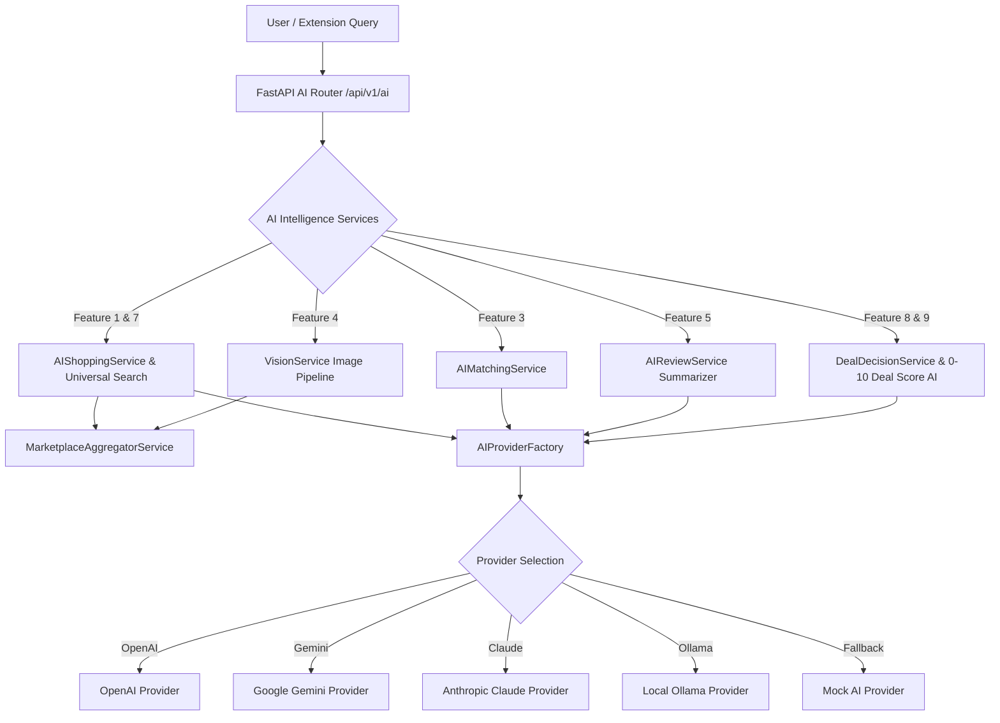

<div align="center">
  
  <br /><br />
  
  <a href="#">
    
  </a>
  <a href="#">
    
  </a>
  <a href="#">
    
  </a>
  <a href="#">
    
  </a>
  <a href="#">
    
  </a>
  <a href="#">
    
  </a>
  <br /><br />
  
  <h1>COMPAREX</h1>
  <p><strong>AI Shopping Intelligence Platform</strong></p>
  <p>Compare products across 10+ marketplaces with real-time prices, AI recommendations, and instant deal alerts.</p>
</div>

---

## 🚀 Overview

COMPAREX is a production-quality AI Shopping Intelligence Platform that aggregates product pricing from multiple marketplaces, applies AI-driven analysis, and delivers personalized shopping insights.

- **Phase 1**: Project foundation (Frontend shell, FastAPI backend, Docker, GitHub Actions).
- **Phase 2**: Core authentication, JWT state management, Remember Me, protected routes, interactive dashboard widgets, product catalog & price comparison matrix.
- **Phase 3**: Marketplace Intelligence Core — complete normalized domain models (`Product`, `Marketplace`, `ProductListing`, `PriceHistory`, `Category`, `Brand`, `ProductSpecification`, `ProductImage`), Marketplace Abstraction Layer & `MarketplaceFactory`, Comparison Engine, non-AI Product Matching Engine, dedicated Compare UI (`/compare/[id]`), and 100% clean CI linters.
- **Phase 4**: Production-Ready Marketplace Connector Framework — `ConnectorRegistry`, `CategoryCapabilityRegistry`, 9 specialized retail mock connectors (Amazon, Flipkart, Croma, Reliance Digital, Vijay Sales, Myntra, Ajio, Meesho, Nykaa), `MarketplaceAggregatorService` with concurrent query gathering, deduplication, deal-scoring, Redis response caching (TTL 300s), aggregator APIs (`/comparison/aggregate`), and Live Aggregator UI (`/compare`).
- **Phase 5**: Browser Extension Ecosystem — Manifest V3 extension (`extension/`), Background Service Worker, public product extractor, floating draggable comparison overlay (`overlay/`), popup UI (`popup/`), options page (`options/`), messaging bus, storage abstraction, extension gateway APIs (`/extension/product`, `/extension/status`, `/extension/version`), and web onboarding pages (`/extension`, `/extension/settings`).
- **Phase 6**: AI Shopping Intelligence Platform — `BaseAIProvider` abstraction layer (`AIProviderFactory` supporting OpenAI, Gemini, Claude, Ollama, and Mock), AI Shopping Assistant, Explain My Choice, AI Product Matching, Image Search Architecture, AI Review Intelligence, Smart Alternatives, Universal Search Intelligence, Shopping Decision Engine, Deal Score AI, Specification Intelligence, versioned AI APIs (`/api/v1/ai/*`), and interactive frontend AI hubs (`/ai-assistant`, `/ai/deal-analysis`, `/ai/review-summary`, `/ai/image-search`).
- **Phase 7**: Smart Shopping Ecosystem — Browser Extension 2.0 (floating COMPAREX button, instant comparison panel, auto info copy, SPA change detection, account sync across 9 stores), Price History System (graph data, lowest/highest/average/today's price, weekly/monthly trends, volatility, target predictions), Smart Price Drop Alerts (watchlist, target threshold alerts), Smart Coupon Engine (discovery, validation, auto-apply, cashback, bank/wallet offers, 0-100% confidence score), AI Shopping Advisor ("Buy Now" vs "Wait for Sale" verdicts, expected future prices, alternatives), Shopping Dashboard (widgets for saved products, wishlist, price alerts, coupon savings, money saved stats), Redis caching performance, unit test suite (`test_phase7.py`), and 100% green CI pipeline.
- **Phase 8**: Personal Shopping Intelligence Platform — Opt-in Personal Shopping Profile (`ShoppingProfile`), Shopping Memory Timeline (`ShoppingMemory`), Multi-Agent AI System (`AIAgentOrchestrator` with 9 specialized delegates), Shopping DNA Personas (`ShoppingDNA`), Grounded Personalized Recommendation Engine, AI Shopping Coach (`/coach`), Explainable AI & CompareX Explain ("Why not Product B?", `/explain`), Shopping Knowledge Graph (`KnowledgeGraph`), AI Recommendation Rating Feedback Loop (`AIFeedback`), Shopping Analytics Dashboard (`/analytics`), Smart Privacy Center with full data export & AI purging (`/privacy`), Voice & Plugin interfaces (`plugins.py`, `voice.py`), unit test suite (`test_phase8.py`), and 100% green CI pipeline.

---

## 🤖 Phase 6 AI Architecture & Provider Layer



---

## 🛠 Technology Stack

### Frontend & AI UI
| Technology | Purpose |
|---|---|
| **Next.js 15** (App Router) | React framework with SSR & Turbopack |
| **Manifest V3** | Chrome Extension architecture |
| **TypeScript** | Type safety across web app & DTO schemas |
| **Tailwind CSS** | Utility-first styling |
| **Framer Motion** | Smooth micro-animations |
| **Lucide React** | Icon system |

### Backend & AI Platform
| Technology | Purpose |
|---|---|
| **FastAPI** | High-performance Python API framework |
| **AI Provider Abstraction** | OpenAI, Gemini, Claude, Ollama, and Mock providers |
| **SQLAlchemy 2.0** (async) | ORM with async support & Repository pattern |
| **Alembic** | Database schema migrations |
| **Pydantic v2** | Data validation & settings |
| **Pytest** | Async unit & integration test suite (19 tests) |
| **Upstash / Local Redis** | Fast caching for aggregator responses & JWT blacklist |

---

## 📁 Folder Structure

```
COMPAREX/
├── .github/
│   └── workflows/
│       └── ci.yml                   # GitHub Actions CI (lint + startup + 19 pytest tests)
├── extension/                       # Manifest V3 Browser Extension Ecosystem
├── frontend/
│   ├── src/
│   │   ├── app/
│   │   │   ├── ai-assistant/        # AI Shopping Assistant Chat (/ai-assistant)
│   │   │   ├── ai/deal-analysis/    # Shopping Decision Engine & Deal Score AI (/ai/deal-analysis)
│   │   │   ├── ai/review-summary/   # AI Review Intelligence (/ai/review-summary)
│   │   │   ├── ai/image-search/     # Visual Image Search (/ai/image-search)
│   │   │   ├── compare/             # Live Multi-Marketplace Aggregator (/compare)
│   │   │   ├── compare/[id]/        # Product Comparison Matrix View
│   │   │   ├── dashboard/           # Dashboard & Settings
│   │   │   ├── extension/           # Onboarding & Extension Settings Sync
│   │   │   ├── products/            # Catalog & Details
│   │   │   └── page.tsx             # Landing Page
│   │   ├── components/              # Shared UI components & badges
│   │   └── types/
│   │       └── index.ts             # TypeScript interfaces for Aggregator, Extension & AI
├── backend/
│   ├── app/
│   │   ├── ai/                      # AI Shopping Intelligence Platform Module
│   │   │   ├── agents/              # Shopping & Review Agents
│   │   │   ├── prompts/             # System Prompts & Templates
│   │   │   ├── providers/           # BaseAIProvider, OpenAI, Gemini, Claude, Ollama, Mock & Factory
│   │   │   ├── schemas/             # Pydantic v2 AI DTO Schemas
│   │   │   └── services/            # AIShoppingService, AIMatchingService, VisionService, AIReviewService, DealDecisionService
│   │   ├── adapters/                # BaseMarketplaceAdapter, ConnectorRegistry, CategoryCapabilityRegistry, 9 Mock Connectors
│   │   ├── api/v1/endpoints/        # ai, extension, comparison, marketplaces, products, brands, listings, auth, users
│   │   ├── core/                    # config, security, redis
│   │   └── services/                # MarketplaceAggregatorService, ComparisonEngineService, ProductMatchingEngine
│   ├── tests/                       # Pytest test suite (test_phase3.py, test_phase4.py, test_phase5.py, test_phase6.py)
│   └── .flake8
└── README.md
```

---

## 🧪 Testing & Verification

```bash
# Backend Verification
cd backend
flake8 app/       # Flake8 lint check (0 errors)
pytest            # Pytest test suite (100% pass - 19 tests)

# Frontend Verification
cd frontend
npm run lint      # ESLint (0 errors)
npm run build     # Production build check (22 routes generated)
```

---

## 📑 AI Intelligence Platform API Summary (v1)

| Method | Endpoint | Description | Auth Required |
|---|---|---|---|
| `POST` | `/api/v1/ai/chat` | AI Shopping Assistant natural language chat & connector aggregation | No |
| `POST` | `/api/v1/ai/recommendations` | AI Recommendation Engine & Explain My Choice reasoning | No |
| `POST` | `/api/v1/ai/match` | AI multi-attribute product matching & confidence score | No |
| `POST` | `/api/v1/ai/image-search` | Visual product image search pipeline & feature extraction | No |
| `POST` | `/api/v1/ai/review-summary` | AI Review Intelligence (Pros, Cons, Summary, Verdict, Score) | No |
| `POST` | `/api/v1/ai/deal-analysis` | Shopping Decision Engine, 0-10 Deal Score AI & Smart Alternatives | No |
| `POST` | `/api/v1/ai/spec-comparison` | Feature-by-feature specification intelligence comparison | No |

---

## 🗺 Roadmap

### ✅ Phase 1 – Foundation
- Landing page, layout structure, FastAPI & Docker setup.

### ✅ Phase 2 – Backend Completion & Frontend Integration
- JWT auth, session persistence, Remember Me, protected routes, interactive dashboard widgets, product catalog & detail views.

### ✅ Phase 3 – Marketplace Intelligence Core
- Domain models (`Brand`, `ProductSpecification`, `ProductImage`, `ProductListing`, `PriceHistory`), `MarketplaceFactory`, `ComparisonEngineService`, `ProductMatchingEngine`.

### ✅ Phase 4 – Marketplace Connector Framework
- `BaseMarketplaceAdapter` & `BaseMarketplaceConnector` standard interface, `ConnectorRegistry` managing 9 retail connectors, `CategoryCapabilityRegistry`, `MarketplaceAggregatorService` with concurrent queries, Redis response caching (TTL 300s), and `/compare` live aggregator.

### ✅ Phase 5 – Browser Extension Ecosystem
- Top-level `extension/` directory with Manifest V3, Background Service Worker, Public Extractor, Floating Draggable Overlay, Popup UI, Options UI, Extension Gateway APIs (`/extension/product`, `/extension/status`, `/extension/version`), and web onboarding pages (`/extension`, `/extension/settings`).

### ✅ Phase 6 – AI Shopping Intelligence Platform
- Provider abstraction layer (`BaseAIProvider`, `AIProviderFactory` supporting OpenAI, Gemini, Claude, Ollama, and Mock), AI Shopping Assistant, Explain My Choice, AI Product Matching, Image Search Architecture, AI Review Intelligence, Smart Alternatives, Universal Search Intelligence, Shopping Decision Engine, Deal Score AI, Specification Intelligence, versioned AI APIs (`/api/v1/ai/*`), and interactive frontend AI hubs (`/ai-assistant`, `/ai/deal-analysis`, `/ai/review-summary`, `/ai/image-search`).

### 🔜 Phase 7 – Smart Shopping Features & Production Deployment
- Price drop alert notifications & automated email triggers.
- Production deployment scripts, SSL, domain routing, and infrastructure monitoring.

---

## 📄 License

MIT License — see [LICENSE](LICENSE) for details.
